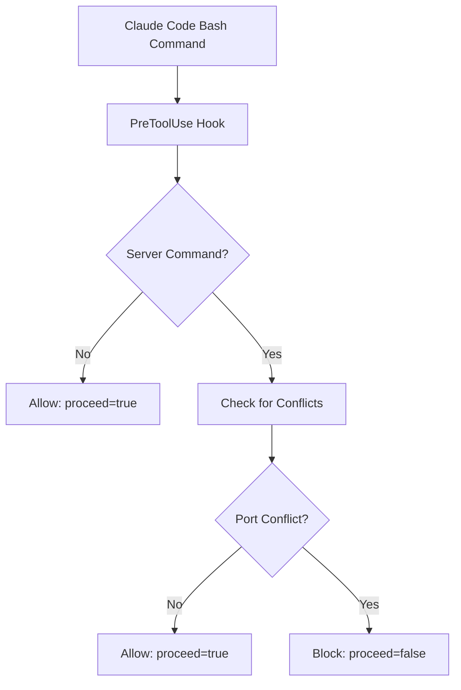
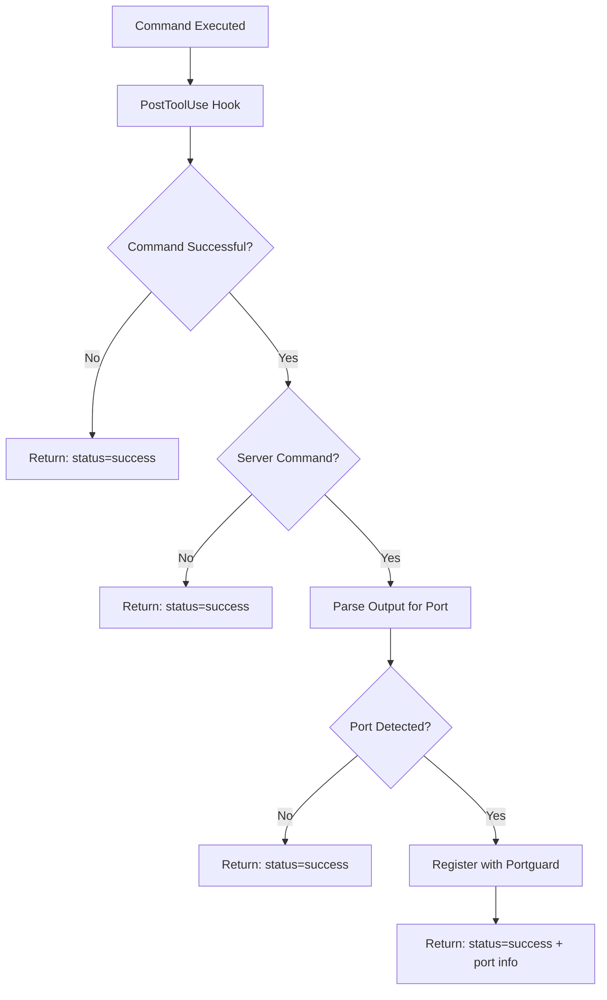

# Claude Code Integration Guide

This guide explains how to integrate Portguard with Claude Code using the official hooks specification.

## Overview

Portguard provides seamless integration with Claude Code through hooks that:

- **Prevent duplicate server processes** before they start
- **Register successful server startups** for future conflict detection
- **Use official Claude Code hooks format** for maximum compatibility

## Quick Installation

### One-Command Setup (Recommended)

```bash
# Install with default settings
portguard hooks install

# Choose a specific template
portguard hooks install basic     # Simple conflict prevention
portguard hooks install advanced  # Health monitoring + lifecycle
portguard hooks install developer # Full workflow optimization
```

This will:

1. Create hook scripts in `~/.config/claude-code/hooks/`
2. Update your Claude Code `settings.json`
3. Configure environment variables
4. Set up proper permissions

### Verify Installation

```bash
# Check installation status
portguard hooks status

# List installed hooks
portguard hooks list

# Test the hooks
echo '{"event":"preToolUse","tool_name":"Bash","parameters":{"command":"npm run dev"}}' | \
  ~/.config/claude-code/hooks/pretooluse.sh
```

## Manual Installation

If you prefer manual setup or need customization:

### Step 1: Copy Hook Scripts

```bash
mkdir -p ~/.config/claude-code/hooks
cp hooks/pretooluse.sh ~/.config/claude-code/hooks/
cp hooks/posttooluse.sh ~/.config/claude-code/hooks/
chmod +x ~/.config/claude-code/hooks/*.sh
```

### Step 2: Configure Claude Code Settings

Edit `~/.config/claude-code/settings.json`:

```json
{
  "$schema": "https://schema.anthropic.com/claude-code/settings.json",
  "hooks": [
    {
      "matchers": [
        {
          "tool": "Bash"
        }
      ],
      "hooks": [
        {
          "event": "preToolUse",
          "command": "~/.config/claude-code/hooks/pretooluse.sh",
          "timeout": 10000,
          "failureHandling": "allow",
          "description": "Prevent duplicate server processes",
          "environment": {
            "PORTGUARD_BIN": "portguard"
          }
        },
        {
          "event": "postToolUse",
          "command": "~/.config/claude-code/hooks/posttooluse.sh",
          "timeout": 5000,
          "failureHandling": "ignore",
          "description": "Register successful server startups",
          "environment": {
            "PORTGUARD_BIN": "portguard"
          }
        }
      ]
    }
  ]
}
```

### Step 3: Test the Integration

Test PreToolUse hook:

```bash
echo '{"event":"preToolUse","tool_name":"Bash","parameters":{"command":"npm run dev"}}' | \
  ~/.config/claude-code/hooks/pretooluse.sh
```

Expected output:

```json
{
  "proceed": true,
  "message": "Server command allowed, no conflicts",
  "data": {
    "detected_port": 3000
  }
}
```

Test PostToolUse hook:

```bash
echo '{"event":"postToolUse","tool_name":"Bash","parameters":{"command":"npm run dev"},"result":{"success":true,"output":"Server listening on port 3000"}}' | \
  ~/.config/claude-code/hooks/posttooluse.sh
```

Expected output:

```json
{
  "status": "success",
  "message": "Server registered on port 3000",
  "data": {
    "port": 3000
  }
}
```

## How It Works

### PreToolUse Hook Flow

1. **Hook Triggered**: Claude Code calls the PreToolUse hook before executing any Bash command
2. **Command Analysis**: Hook analyzes the command to detect server startup patterns
3. **Conflict Check**: If it's a server command, check for existing processes on the same port
4. **Response**: Return JSON with `proceed: true/false` and explanation



### PostToolUse Hook Flow

1. **Hook Triggered**: Claude Code calls the PostToolUse hook after command execution
2. **Success Check**: Only process successful commands
3. **Output Analysis**: Parse command output for server startup messages
4. **Registration**: Register detected servers with Portguard for future conflict detection



## Server Command Detection

Portguard automatically detects common server startup patterns:

### Node.js/JavaScript

```bash
npm run dev
npm start
yarn dev
yarn start
pnpm dev
next dev
vite
webpack-dev-server
```

### Python

```bash
python app.py
flask run
django-admin runserver
uvicorn main:app
gunicorn app:application
```

### Go

```bash
go run main.go
go run server.go
```

### Ruby

```bash
rails server
rails s
```

### Port Detection

Ports are detected from:

1. **Command flags**: `--port 3000`, `-p 8080`
2. **Command output**: "Server listening on port 3000"
3. **Default ports**: Framework-specific defaults (Next.js → 3000, Vite → 5173, Flask → 5000)

## Configuration Options

### Environment Variables

Set in your shell or Claude Code settings:

```bash
export PORTGUARD_BIN="portguard"          # Path to portguard binary
export PORTGUARD_DEBUG="1"                # Enable debug logging
export PORTGUARD_CONFIG="~/.portguard.yml" # Custom config file
```

### Hook Configuration

Customize timeout and failure handling in `settings.json`:

```json
{
  "event": "preToolUse",
  "command": "~/.config/claude-code/hooks/pretooluse.sh",
  "timeout": 10000,           // 10 seconds timeout
  "failureHandling": "allow", // allow|block|warn|ignore
  "environment": {
    "PORTGUARD_BIN": "portguard",
    "PORTGUARD_DEBUG": "0"
  }
}
```

## Templates

Portguard provides three templates for different use cases:

### Basic Template

- Simple server conflict prevention
- Minimal overhead
- Recommended for most users

### Advanced Template  

- Health monitoring
- Process lifecycle tracking
- Detailed logging
- Recommended for teams

### Developer Template

- Full workflow optimization
- Custom port management
- Advanced debugging
- Recommended for power users

## Troubleshooting

### Common Issues

**1. Hooks not triggering**

- Check Claude Code version compatibility
- Verify settings.json format
- Ensure scripts are executable: `chmod +x ~/.config/claude-code/hooks/*.sh`

**2. "portguard not found" error**

- Add portguard to PATH: `export PATH="/path/to/portguard:$PATH"`
- Or set full path: `"PORTGUARD_BIN": "/usr/local/bin/portguard"`

**3. Permission denied**

- Fix script permissions: `chmod +x ~/.config/claude-code/hooks/*.sh`
- Check directory permissions: `ls -la ~/.config/claude-code/`

**4. JSON parsing errors**

- Install jq: `brew install jq` (macOS) or `apt-get install jq` (Ubuntu)
- Verify jq installation: `jq --version`

### Debug Mode

Enable debug logging:

```bash
export PORTGUARD_DEBUG=1
```

Check logs:

```bash
# View recent hook activity
tail -f ~/.config/claude-code/logs/hooks.log

# Test hooks manually
echo '{"event":"preToolUse","tool_name":"Bash","parameters":{"command":"npm run dev"}}' | \
  PORTGUARD_DEBUG=1 ~/.config/claude-code/hooks/pretooluse.sh
```

### Hook Status Check

```bash
# Comprehensive status check
portguard hooks status

# List all hooks and templates
portguard hooks list

# Check dependencies
command -v jq && echo "jq: OK" || echo "jq: MISSING"
command -v portguard && echo "portguard: OK" || echo "portguard: MISSING"
```

## Advanced Usage

### Custom Hook Scripts

You can customize the hook scripts for specific needs:

```bash
# Copy default scripts as templates
cp ~/.config/claude-code/hooks/pretooluse.sh ~/.config/claude-code/hooks/my-pretooluse.sh

# Edit for custom logic
vim ~/.config/claude-code/hooks/my-pretooluse.sh

# Update settings.json to use custom script
```

### Integration with CI/CD

For automated environments:

```yaml
# .github/workflows/test.yml
- name: Setup Portguard
  run: |
    # Install portguard
    go install github.com/paveg/portguard@latest
    
    # Install hooks
    portguard hooks install --config ci-config.json
    
    # Verify installation
    portguard hooks status
```

### Multiple Projects

Different configurations per project:

```bash
# Project-specific installation
cd /path/to/project
portguard hooks install --config .claude-code/settings.json

# Use project-specific portguard config
echo 'PORTGUARD_CONFIG="./.portguard.yml"' >> .env
```

## Migration from V1

If you're migrating from an older version:

```bash
# Remove old V1 hooks
rm ~/.config/claude-code/hooks/pretooluse_v1.sh
rm ~/.config/claude-code/hooks/posttooluse_v1.sh

# Install new hooks
portguard hooks install

# Update settings.json format (automatic)
```

## Support

- **GitHub Issues**: <https://github.com/paveg/portguard/issues>
- **Documentation**: <https://github.com/paveg/portguard/wiki>
- **Examples**: <https://github.com/paveg/portguard/tree/main/examples>
